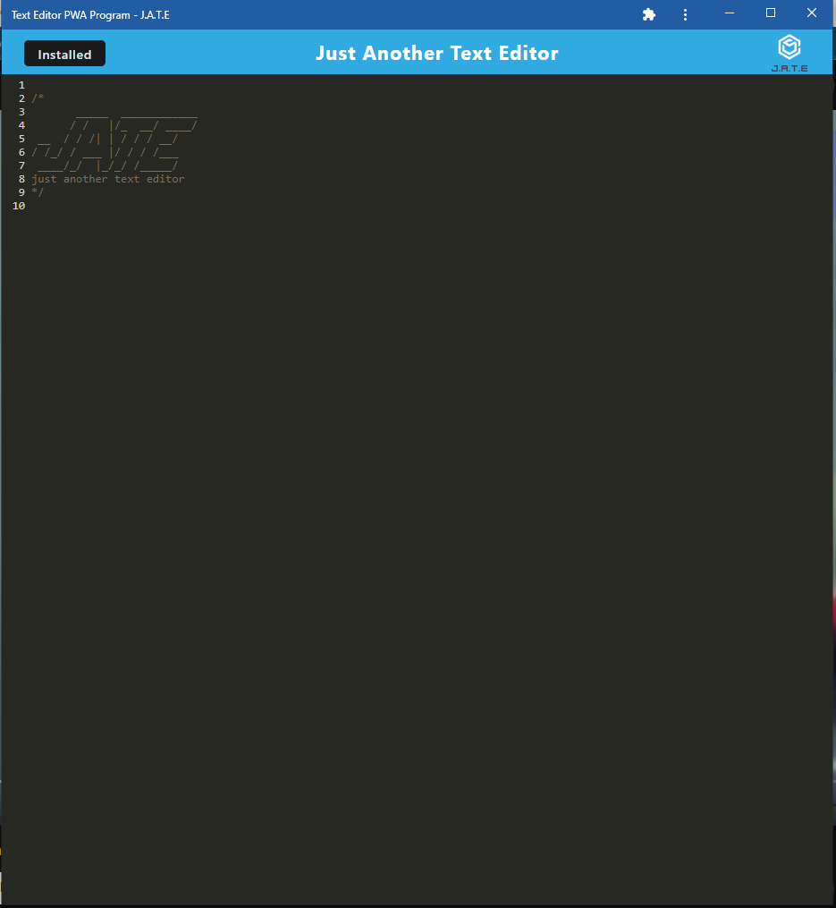

# Text Editor PWA "JATE"

## Description
A text editor that runs in the browser. The app is a single-page application. It features a number of data persistence techniques that serve as redundancy in case one of the options is not supported by the browser. The application can also function offline.

## Reason for building
Cause I need more completed assignments to finish the class (>.>)

## Install
- clone the repo
- npm i
- npm run start
- open browser at localhost:3000
- from here you can type code into the editor
- if you want to install  the app click on the "install" button, located in the upper lefthand corner
- this will create an icon on your desktop
- click the icon and it will open the text editor in an offline window

## Screenshots
### In browser screenshot

### Offline Screenshot

## Link to repo

[My Repo!](https://github.com/sobewon/basic-tex-editor)

## Link to my GitHub
[John Magnuson / Sobewon's GitHub](https://github.com/sobewon)

## Link to launched app

[Live Application Link](https://github.com/sobewon)
